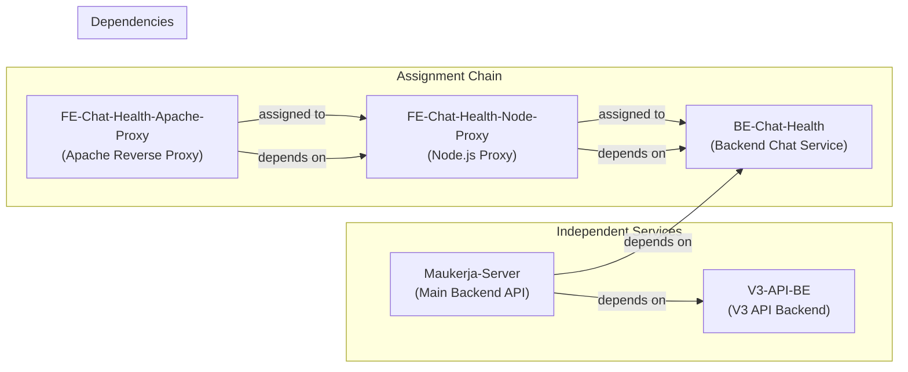
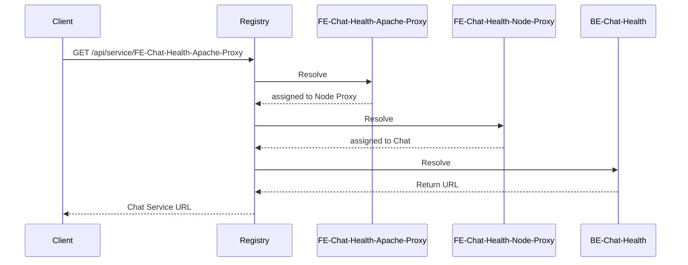
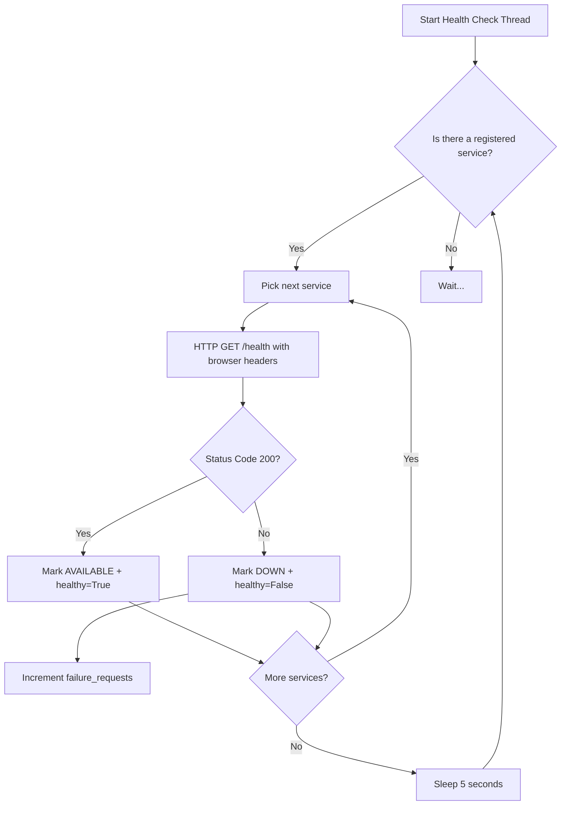
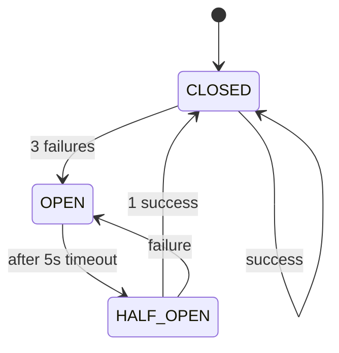
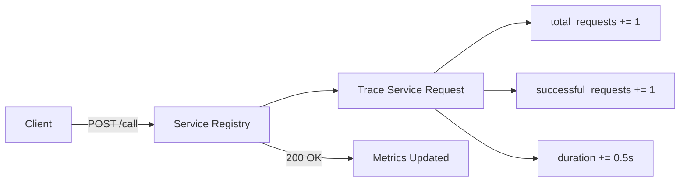
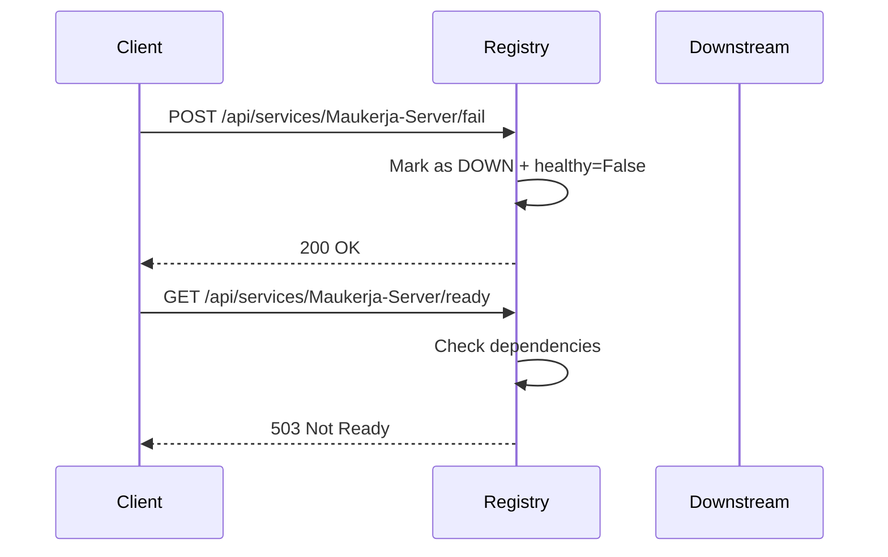
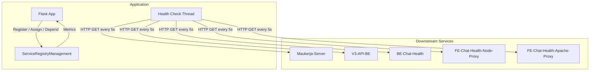

# Service Registry Architecture

This document explains the internals of the service registry management library and the topology mesh that has been wired up within MauKerja chat services on the production environment. It covers the design decisions, data flow, and how the library simulates a service registry pattern with circuit breaker and health checking features. The document also includes API endpoints, usage examples, and future considerations for production deployment

## 1. Overview

The library implements a lightweight service registry pattern inspired by Netflix Hystrix. It provides four main building blocks:

| Feature | Purpose |
|---------|---------|
| **Service Registration** | Register a service name, URL mapping and hold it in memory |
| **Service Assignment** | Route a service to another one so the caller always hits an available instance |
| **Health Checking** | Periodically probe each registered URL and mark it `AVAILABLE`, `STARTING`, or `DOWN` |
| **Circuit Breaker** | After 3 consecutive failures, open the circuit and stop hammering the unhealthy service for 5 seconds |
| **Request Tracing** | Count total, successful, and failed requests, and measure cumulative duration |

## 2. Topology Mesh

The current implementation as per the first week of June 2026, the system is pre-registered with five downstream services which are related to the Chat services that are widely used on the MauKerja platform. Two of them are chained together via assignments, while three others are independent. Dependencies define readiness constraints:



### 2.1 Assignments

Assignments create a routing chain. When you ask the registry for `FE-Chat-Health-Apache-Proxy`, it transparently returns the URL of `FE-Chat-Health-Node-Proxy`. Ask for the Node proxy and you get `BE-Chat-Health`.



### 2.2 Dependencies

A background daemon thread wakes up every 5 seconds and probes each registered service URL. The request includes real browser headers to bypass CloudFlare bot detection such as with user-agent or upgrade-insecure-requests.

| Service | Readiness Gate |
|---------|-------------|
| `Maukerja-Server` | `V3-API-BE` AND `BE-Chat-Health` must be AVAILABLE |
| `FE-Chat-Health-Node-Proxy` | `BE-Chat-Health` must be AVAILABLE |
| `FE-Chat-Health-Apache-Proxy` | `FE-Chat-Health-Node-Proxy` must be AVAILABLE |
| `BE-Chat-Health` | No dependencies (always ready if AVAILABLE) |
| `V3-API-BE` | No dependencies (always ready if AVAILABLE) |

## 3. Health Checking

A background daemon thread wakes up every 5 seconds and probes each registered service URL. The request includes real browser headers to bypass CloudFlare bot detection such as with `user-agent` or `upgrade-insecure-requests`.



## 4. Circuit Breaker

Every health check call is wrapped in a circuit breaker with:

- **Threshold:** 3 consecutive failures before opening the circuit
- **Timeout:** 5 seconds in OPEN state before trying again (`HALF_OPEN`)



When the circuit is **OPEN**, any further request returns `None` immediately without touching the network. This prevents cascading overload on an already failing downstream.

## 5. Request Tracing

When you simulate a call with `POST /api/services/<name>/call`, the registry increments global counters:

- `total_requests`
- `successful_requests` (always true for simulation)
- `failure_requests`
- `duration` (cumulative)



## 6. Simulating Failures

You can force a service into the `DOWN` state with `POST /api/services/<name>/fail`. This is quite straightforward and pretty useful for testing how upstream services react when a downstream dependency disappears. Since, the main sources of the Chat services were invoked through different party



## 7. API Endpoints

| Method | Path | Description |
|--------|------|-------------|
| `GET` | `/api/health` | Registry self-health |
| `GET` | `/api/external-health` | Health of all downstream services |
| `POST` | `/api/services` | Register a new service |
| `GET` | `/api/services` | List all registered services |
| `GET` | `/api/service/:name` | Resolve a service URL (follows assignments) |
| `POST` | `/api/services/assign` | Assign one service to another |
| `POST` | `/api/services/:name/fail` | Mark a service as unhealthy |
| `POST` | `/api/services/:name/call` | Trace a request to a service |
| `GET` | `/api/services/:name/ready` | Check if service is ready (deps healthy) |
| `POST` | `/api/dependencies` | Register a dependency |
| `GET` | `/api/metrics` | Read request tracing counters |
| `DELETE` | `/api/services/:name` | Deregister a service |

## 8. Data Flow Summary



## 9. Caveats

At the moment, there were a few items that needed to be addressed before they were going to be adopted or at least made as production-grade ready. Those are:

- **No async support**. By all means, the service assignment is synchronous and resolves to the first available index. If that service is also unhealthy, no fallback will be attempted automatically
- **In-memory state**. All registry data is held in memory and does not persist across restarts. There is no database or external storage which holds logs or particular events
- **Single instance**. No clustering or leader election is implemented

## 10. Getting Started

```bash
# Start the server
python app.py

# Register a new downstream service
curl -X POST http://localhost:5000/api/services \
  -H "Content-Type: application/json" \
  -d '{"service_name": "MyAPI", "service_url": "https://api.example.com/health"}'

# Assign it to a fallback
curl -X POST http://localhost:5000/api/services/assign \
  -H "Content-Type: application/json" \
  -d '{"service_name": "MyAPI", "assigned_service": "V3-API-BE"}'

# Trace a request
curl -X POST http://localhost:5000/api/services/MyAPI/call

# See metrics
curl http://localhost:5000/api/metrics
```

## 11. History & Origin

This library was initially built as part of the research and development team's effort to implement distributed tracing, alongside tools like Jaeger and OpenTelemetry. Development began in 2023 by myself as an internal exploration into service mesh patterns and self-healing architectures.

Initially, the team did not adopt Jaeger or OpenTelemetry back in 2021. However, by the end of 2023, both tracing systems were eventually adopted across the broader platform, and this experimental library was gradually shelved and postponed

Fast forward to 2026: the chat services needed to become fully independent and required their own lightweight monitoring system. In June 2026, this library resurfaced. The Backend and Frontend teams decided to run live experiments with it as a dedicated health-check and service-assignment layer for the chat infrastructure, reviving the original codebase and extending it with real downstream services

## 12. Production Deployment (24/7)

The repository includes a Docker Compose setup designed for continuous operation.

### 12.1 Docker Compose Stack

| File | Purpose |
|------|---------|
| `Dockerfile` | Python 3.12 slim image with Gunicorn as the WSGI server |
| `docker-compose.yml` | Orchestrates the container with restart policy and health checks |
| `requirements.txt` | Pins Flask, Requests, and Gunicorn versions |
| `.dockerignore` | Keeps the image lean |

### 12.2 Key Production Settings

- **Gunicorn** runs with 4 workers and a 120-second timeout to handle slow downstream responses.
- **Restart policy** is set to `always` so the container recovers automatically after a host reboot or crash.
- **Health check** pings `/api/health` every 30 seconds; Docker restarts the container if it fails 3 times in a row.
- **Resource limits** are capped at 1 CPU and 512 MB RAM to prevent a runaway process from starving the host.
- **Flask** runs with `debug=False` and `threaded=True` for safe concurrent request handling.

### 12.3 Deploy

```bash
# Build and start
docker compose up --build -d

# View logs
docker compose logs -f

# Restart after code changes
docker compose down && docker compose up --build -d
```

### 12.4 Monitoring

Because the library is in-memory, you should monitor the host itself:

- **Container uptime** via Docker health status
- **CPU / memory** via `docker stats` or host metrics
- **Downstream health** via the `/api/external-health` endpoint (poll every 60s)
- **Request metrics** via `/api/metrics` (total, success, failure counts)

## 13. Future Considerations

This library is intentionally lightweight, but several enhancements would make it production-grade for a larger mesh. Especially, the targeted environment possibly grows larger since we also need to opt-in the Chat services for other platforms

| Improvement | Rationale |
|-------------|-----------|
| **Persistent state** | SQLite or Redis so registrations and assignments survive restarts |
| **Async health checks** | `asyncio` or `aiohttp` to avoid blocking the GIL during slow probes |
| **Clustering** | Multiple instances with a shared backend (for example, Consul or etcd) for high availability |
| **Authentication** | API key or mTLS on the registry endpoints to prevent unauthorized deregistration |
| **Prometheus metrics** | Export counters and histograms in `/metrics` format for scraping |
| **Load balancing strategies** | Round-robin or least-latency instead of first-available assignment |
| **Custom health thresholds** | Per-service timeout and failure-threshold configuration |
| **Graceful shutdown** | Drain in-flight requests before stopping the health check thread |
| **TLS termination** | Run Gunicorn with certificates instead of handling TLS inside Flask |