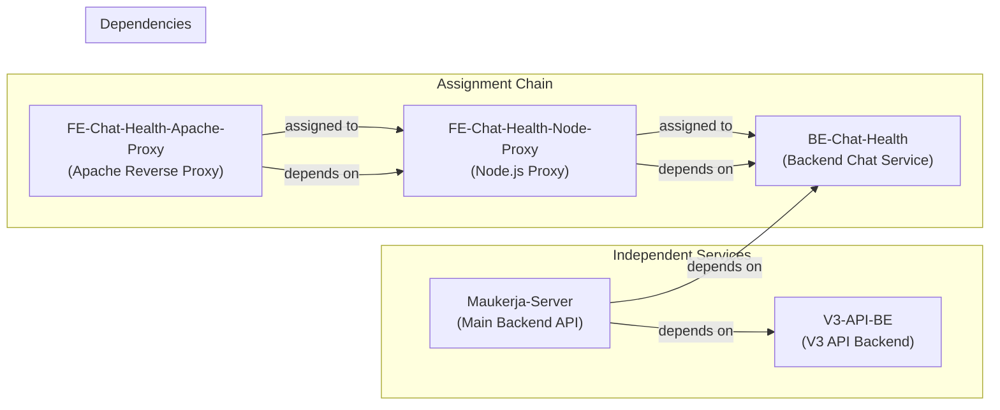
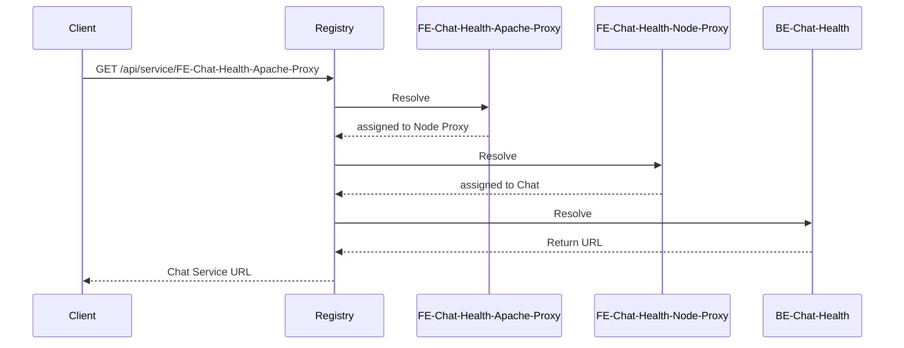
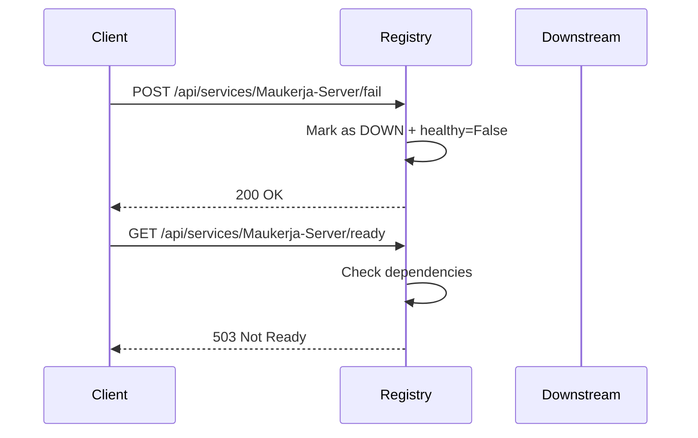
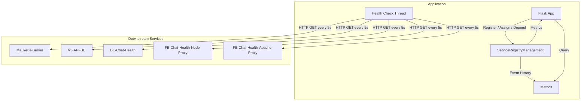

# Production Topology: MauKerja Chat Infrastructure

This document describes how the service registry is used in a real production environment: the MauKerja chat infrastructure as of June 2026.

The system is pre-registered with five downstream services. Two are chained together via assignments, while three are independent. Dependencies define readiness constraints across the mesh.

!!! note
    This is a **real-world example**. Your own topology will differ. You may edit [`services.py`](https://github.com/sodrooome/service-registry/blob/main/services.py) to match your services, assignments, and dependencies.

## Topology Mesh



### Assignments

Assignments create a routing chain. When you resolve `FE-Chat-Health-Apache-Proxy`, the registry transparently returns the URL of `FE-Chat-Health-Node-Proxy`. Resolving that returns `BE-Chat-Health`:



This is how the Apache proxy routes through Node.js to the backend chat service — a chain of three hops collapsed into a single lookup.

### Dependencies

A dependency means a service is only considered **ready** when all services it depends on are `AVAILABLE`:

| Service | Readiness Gate |
|---------|----------------|
| `Maukerja-Server` | `V3-API-BE` **AND** `BE-Chat-Health` must be AVAILABLE |
| `FE-Chat-Health-Node-Proxy` | `BE-Chat-Health` must be AVAILABLE |
| `FE-Chat-Health-Apache-Proxy` | `FE-Chat-Health-Node-Proxy` must be AVAILABLE |
| `BE-Chat-Health` | No dependencies (always ready if AVAILABLE) |
| `V3-API-BE` | No dependencies (always ready if AVAILABLE) |

## Wiring It Up

This topology is defined in [`services.py`](https://github.com/sodrooome/service-registry/blob/main/services.py):

```python
# Register all downstream services from config
for name, url in DOWNSTREAM_SERVICES.items():
    registry.register_services(service_name=name, service_url=url)

# Chain the proxies
registry.assign_service(
    service_name="FE-Chat-Health-Apache-Proxy",
    assigned_service_name="FE-Chat-Health-Node-Proxy",
)
registry.assign_service(
    service_name="FE-Chat-Health-Node-Proxy",
    assigned_service_name="BE-Chat-Health",
)

# Define dependency readiness gates
registry.register_dependency(
    service_name="FE-Chat-Health-Node-Proxy",
    depends_on="BE-Chat-Health",
)
registry.register_dependency(
    service_name="FE-Chat-Health-Apache-Proxy",
    depends_on="FE-Chat-Health-Node-Proxy",
)
registry.register_dependency(
    service_name="Maukerja-Server",
    depends_on="V3-API-BE",
)
registry.register_dependency(
    service_name="Maukerja-Server",
    depends_on="BE-Chat-Health",
)
```

## Simulating a Failure in This Topology

You can force a service into the `DOWN` state to observe how the readiness chain reacts:



## Data Flow



## See Also

For general documentation on the service registry library itself, refer to:

- [Home](index.md) — overview and features
- [Getting Started](getting-started.md) — installation, configuration, basic usage
- [API Reference](api-reference.md) — all endpoints with request/response examples
- [Configuration](configuration.md) — environment variables and settings
- [Event History](event-history.md) — SQLite persistence internals
- [Deployment](deployment.md) — Docker, Gunicorn, production monitoring
- [Background & History](background.md) — project origin and philosophy