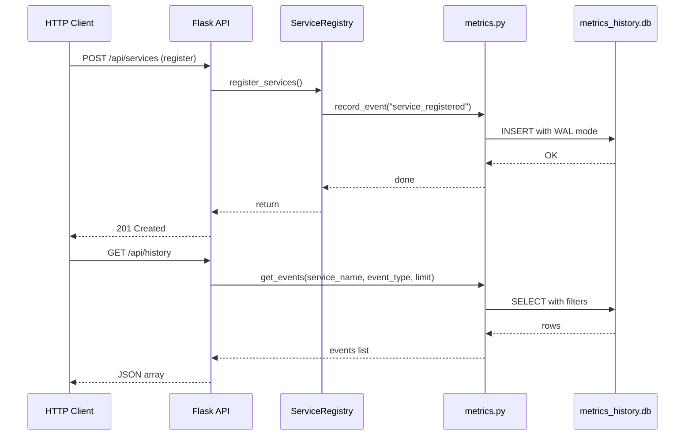

# Event History (SQLite Persistence)

The service registry keeps its core state (registrations, assignments, health status) **in memory** for performance. But in-memory state vanishes on restart. To preserve an audit trail, every meaningful operation also writes to a local SQLite database via `metrics.py`.

## How It Works

Each public operation that mutates registry state triggers a single `INSERT` into the `service_events` table. The row stores:

- A Unix epoch **timestamp**
- The **service name**
- An **event type** string
- A free-text **detail** field

Because SQLite is embedded, the database file lives alongside the application thus no separate server process required. Here's how the event recording flow works:



## Transaction Safety

SQLite itself is thread-safe for reads, but concurrent writes can deadlock or corrupt the journal if multiple threads commit at the exact same moment. To avoid this:

- All write paths acquire a dedicated **`threading.Lock`** before opening a connection
- This serialises inserts so only one thread can commit at a time
- The `record_event()` function always acquires the lock before connecting

### WAL Mode

The database is opened in **WAL (Write-Ahead Logging)** mode. WAL allows readers to proceed while a writer is appending to the log, so the `GET /api/history` endpoint never blocks on an active `record_event()` call.

```python
@contextmanager
def _init_connection():
    connection = sqlite3.connect(DB_PATH, timeout=10)
    try:
        connection.execute("PRAGMA journal_mode=WAL")
        yield connection
    finally:
        connection.close()
```

## Event Types

| Event Type | Triggered By | Detail Example |
|---|---|---|
| `service_registered` | `register_services()` | URL of the registered service |
| `service_deregistered` | `deregister_service()` | Name of the deregistered service |
| `service_assigned` | `assign_service()` | `"ServiceA assigned to ServiceB"` |
| `service_failure` | `simulate_service_is_unhealthy()` | `"simulated failure"` (only on state transition) |
| `request_traced` | `trace_service_request()` | Name of the traced service |
| `dependency_registered` | `register_dependency()` | `"ServiceA depends on ServiceB"` |
| `health_check_healthy` | `_simulate_health_check()` | `"state changed to AVAILABLE"` (only on transition) |
| `health_check_unhealthy` | `_simulate_health_check()` | `"state changed to DOWN"` (only on transition) |

!!! note "Health Check Events"
    Health check events fire **only on state transitions** — not on every 5-second poll. This prevents flooding the database when a service is consistently healthy or unhealthy.

## Querying Events

### Via API

```bash
# All events (most recent first, max 100)
curl http://localhost:5000/api/history

# Filter by service
curl "http://localhost:5000/api/history?service_name=MyAPI"

# Filter by event type
curl "http://localhost:5000/api/history?event_type=service_failure"

# Limit results
curl "http://localhost:5000/api/history?limit=5"

# Combined filters
curl "http://localhost:5000/api/history?service_name=MyAPI&event_type=health_check_healthy&limit=10"
```

### Response Format

```json
[
  {
    "timestamp": 1718000000.123,
    "service_name": "MyAPI",
    "event_type": "service_registered",
    "detail": "https://api.example.com/health"
  }
]
```

## Database Schema

```sql
CREATE TABLE IF NOT EXISTS service_events (
    id INTEGER PRIMARY KEY AUTOINCREMENT,
    timestamp REAL NOT NULL,
    service_name TEXT NOT NULL,
    event_type TEXT NOT NULL,
    detail TEXT
);

CREATE INDEX IF NOT EXISTS idx_service_events_service_name
    ON service_events (service_name);

CREATE INDEX IF NOT EXISTS idx_service_events_event_type
    ON service_events (event_type);

CREATE INDEX IF NOT EXISTS idx_service_events_timestamp
    ON service_events (timestamp);
```

The three indexes ensure efficient filtering by `service_name`, `event_type`, and ordering by `timestamp`.

## Hybrid State Model

The architecture intentionally separates two storage layers:

| Layer | Storage | Characteristics |
|-------|---------|-----------------|
| **Core state** | In-memory (`dict`) | Fast reads/writes, ephemeral, reset-friendly |
| **Event history** | SQLite (`metrics_history.db`) | Durable, survives restarts, queryable via API |

This means:

- **Registrations, assignments, health status** are lost on restart (fast, no I/O)
- **Event audit trail** persists (every operation is logged to disk)
- The two layers are independent, neither blocks the other
