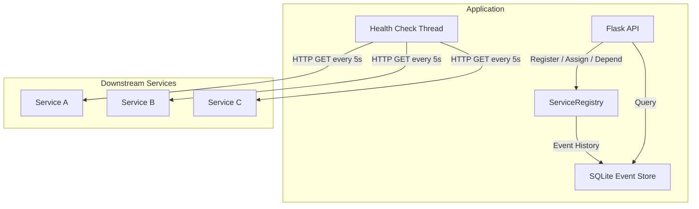

# Service Registry

A lightweight service registry library that implements a service registry pattern with circuit breaker, health checking, request tracing, and persistent event history. It is designed to be embedded in any **platform agnostic application** and provides a simple API for registering services, defining dependencies, and simulating service interactions.

## What is it?

This library provides a lightweight, embeddable service registry for **simulating and managing distributed service interactions**. It was designed to help teams:

- **Simulate** third-party service calls in a controlled environment
- **Self-register** failing services to available alternatives
- **Isolate** failure domains so one broken service doesn't cascade
- **Trace** request metrics across all registered services
- **Persist** an audit trail of every registry event to SQLite

## Core Features

| Feature | Description |
|---------|-------------|
| **Service Registration** | Register services with name-to-URL mappings, held in memory for fast access |
| **Service Assignment** | Route one service to another so callers always hit an available instance |
| **Health Checking** | Background daemon thread probes every registered URL every 5 seconds with browser-grade headers |
| **Circuit Breaker** | After 3 consecutive failures, the circuit opens and stops requests for 5 seconds |
| **Request Tracing** | Count total, successful, and failed requests; measure cumulative duration |
| **Dependency Readiness** | Define service dependencies such as a service is "ready" only when all its dependencies are healthy |
| **Event History** | All registrations, failures, assignments, health transitions, and traces are recorded in SQLite and queryable via API |
| **Thread Safety** | `threading.Lock` guards all shared mutable state across health-check and request threads |

## How It Works



## Quick Start

```bash
# Install dependencies
pip install -r requirements.txt

# Start the server
python app.py

# Register a service
curl -X POST http://localhost:5000/api/services \
  -H "Content-Type: application/json" \
  -d '{"service_name": "MyAPI", "service_url": "https://api.example.com/health"}'

# Check event history
curl http://localhost:5000/api/history
```

## Inspiration

This library follows the microservices patterns described in the [microservices.io](https://microservices.io/patterns/index.html) catalog and is functionally inspired by Netflix Hystrix. While it does not cover every Hystrix feature, it captures the essential behaviour of **fault isolation** and **graceful degradation** in a lightweight, zero-dependency package.
